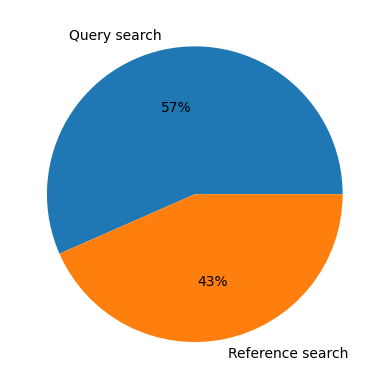
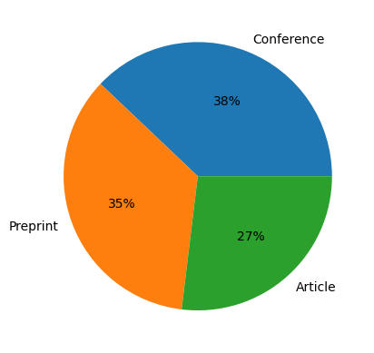
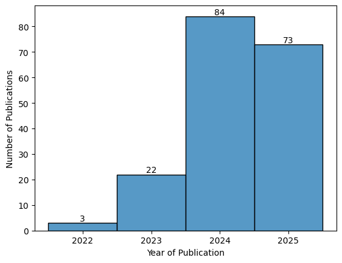
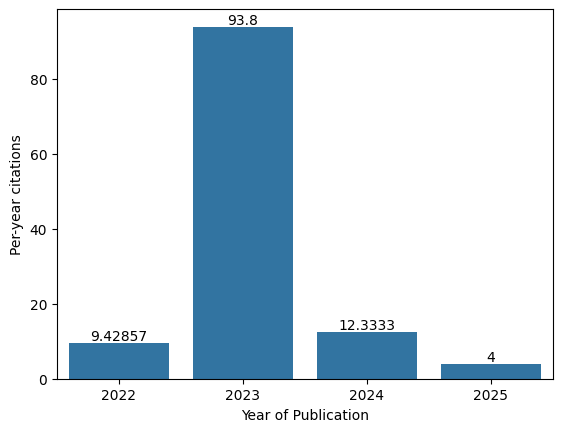
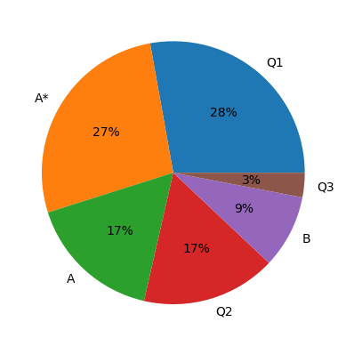
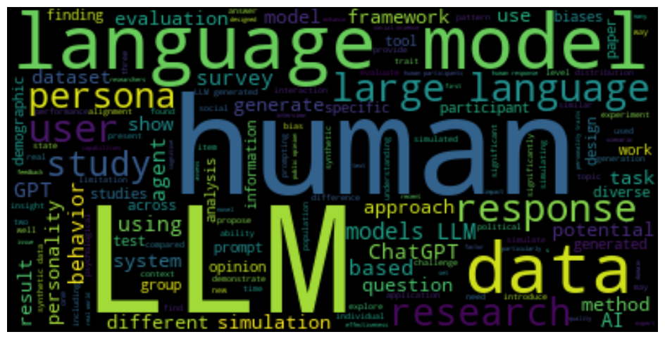
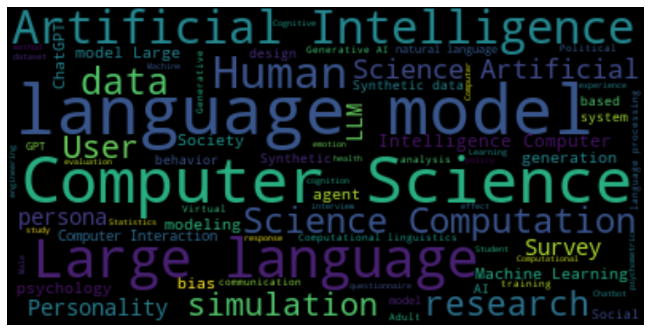
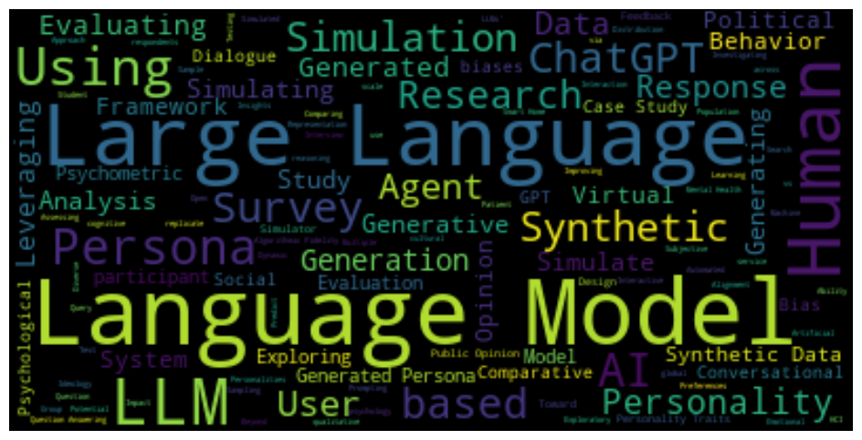
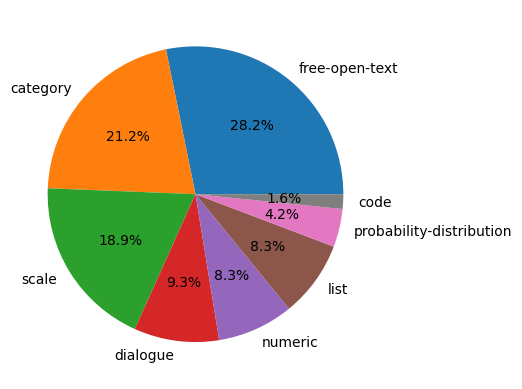
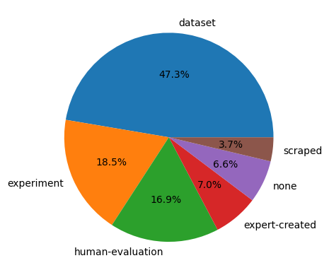

# Synthetic Participants Generated by Large Language Models: A Systematic Literature Review

## About

This is the official repository for the research paper *"Synthetic Participants Generated by Large Language Models: A Systematic Literature Review"*. Paper evaluates the use of Large Language Models as synthetic participants in 182 studies to identify the specific domains, tasks, and techniques currently used to mimic human behavior.

### Paper citation

Not published yet.

### Contents

* [Data](#data)
* [Extended results](#extended-results)
* [Authors](#authors)
* [License](#license)

## Dataset

The [full dataset](./assets/dataset.csv) including 182 research publications contains bibliographic data and relevant data extraction fields:
- title, authors and year of publication
- publication type (article, conference or preprint)
- venue (journal or conference name) and publisher
- volume/number/pages
- URL, doi
- abstract and keywords
- source (query or reference search)
- quality indicator
- citation count
- extracted fields: 
  - domain (e.g. Healthcare)
  - task type (e.g. Questionnaire Simulation)
  - models (e.g. GPT)
  - model parameters (e.g. temperature)
  - prompting strategies (e.g. zero-shot)
  - prompting approach (e.g. single-persona)
  - response type (e.g. tabular data)
  - human data (e.g. dataset, experiment)

## Extended results

### Bibliographic results

Figure 1: A breakdown of search methodologies showing that Query search account for 57% of the data, while Reference searche make up the remaining 43%. 
  

Figure 2: Distribution of publication types highlighting that Conferences are the most common medium at 38%, followed by Preprints (35%) and Articles (27%).
  

Figure 3: Annual publication volume showing a significant upward trend that peaks at 84 publications in 2024.
  

Figure 4: Tracking research impact through per-year citations, which reached a substantial high of 93.8 in 2023.
  

Figure 5: Quality metrics showing a strong performance in high-tier venues, with Q1 (28%) and A* (27%) representing over half of the total rankings. 
  

### Thematic results

Figure 6: A word cloud made from publication abstracts highlighting core research themes.
  

Figure 7: A word cloud made from publication keywords highlighting core research themes.
  

Figure 8: A word cloud made from publication titles highlighting core research themes.
  

### Additional data extraction attributes

Figure 9: Pie chart representing LLM response types.
  

Figure 10: Pie chart representing the source od human data the LLM outputs were compared to.
  

## Authors

### General contact 

Email: 
synthetic.users.research[AT]gmail.com

**Eduard Kuric**\
Eduard Kuric is an associate professor at the [Faculty of Informatics and Information Technologies](https://www.fiit.stuba.sk/), [Slovak University of Technology in Bratislava](https://www.stuba.sk/). His research focuses on human–computer interaction, user modeling, personalized web-based systems, and machine/deep learning.Eduard is also the founder and CEO of [UXtweak](https://www.uxtweak.com/) where he oversees the company’s strategic direction and leads the UXtweak Research department.
- [LinkedIn](https://www.linkedin.com/in/eduard-kuric-b7141280/)
- [Google Scholar](https://scholar.google.com/citations?user=MwjpNoAAAAAJ&hl=en&oi=ao)
- Email: eduard.kuric([AT])stuba.sk

**Peter Demcak**\
Peter Demcak is a researcher with background in software engineering, whose current topics of interest involve user behavior, human-computer interaction, UX research methods and design practices, and machine learning. Currently occupies the position of a scientific and user experience researcher at [UXtweak](https://www.uxtweak.com/), with focus on research that supports work of UX professionals.
- Email: peter.demcak([AT])uxtweak.com

**Matus Krajcovic**\
Matus Krajcovic is a user experience researcher at [UXtweak](https://www.uxtweak.com/) and computer science PhD student at [Faculty of Informatics and Information Technologies](https://www.fiit.stuba.sk/), [Slovak University of Technology in Bratislava](https://www.stuba.sk/). Currently focuses on data analysis and the use of large language models within human-computer interaction research.
- Email: matus.krajcovic([AT])uxtweak.com

## License
This work is licensed under a [Creative Commons Attribution-NonCommercial 4.0 International License](http://creativecommons.org/licenses/by-nc/4.0/).

